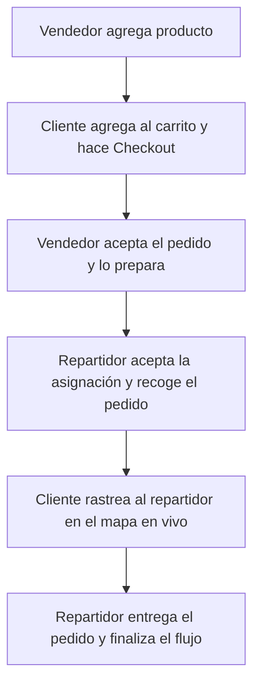

# Guía del Flujo Completo de Pedidos: Negocio ➔ Cliente ➔ Repartidor (Nikama)

Este documento detalla el ciclo de vida completo de un producto y un pedido en la plataforma **Nikama**. Úsalo para indicarle a tu otra IA cómo construir las pantallas (vistas), qué datos mostrar y en qué botones hacer clic para conectar la app móvil de Flutter con el backend.

---

## 🔄 El Ciclo de Vida del Pedido en 6 Pasos

---

## 🏬 Paso 1: El Vendedor (Seller) publica un producto
El flujo inicia cuando un negocio (vendedor) publica un plato o artículo en su menú desde el panel web.

### 🖥️ Vista del Vendedor (Web o App Móvil)
1. **Formulario de Creación de Producto:**
   * **Campos del diseño:** Nombre del producto, precio, precio de oferta (opcional), descripción, stock disponible (opcional), tiempo de preparación estimado (minutos) e imagen principal.
   * **Modificadores (Opciones):** Grupos de opciones como "Elige tu bebida" o "Salsas adicionales" con precios adicionales de ser necesario (ej. Papas adicionales: +S/ 3.50).
2. **Acción del usuario:** El vendedor hace clic en **"Guardar Producto"** o **"Publicar"**.
3. **Vínculo técnico:** Se guarda en la base de datos a través del controlador [SellerProductController.php](file:///c:/Users/ANTHONY/OneDrive/Escritorio/Gestion%20de%20tecnologia/ProyectoFinal_Nikama/nikama-app/app/Http/Controllers/Seller/SellerProductController.php). A partir de este momento, el producto tiene estado `active` y se puede buscar en las APIs públicas.

---

## 📱 Paso 2: El Cliente ve el producto, compra y realiza el Checkout
Aquí es donde el cliente navega en la app móvil de Flutter y realiza el pedido.

### 🖥️ Vista 2.1: Catálogo y Categorías (Home de la App)
1. **Qué se observa en la pantalla:**
   * Un buscador arriba para buscar productos.
   * Carrusel horizontal de categorías (Hamburguesas, Bebidas, etc.).
   * Grid de productos destacados con su foto, precio y nombre del negocio que lo vende.
2. **Acción del usuario:** El cliente hace clic sobre la tarjeta de un producto.
3. **Vínculo técnico:** La app móvil hace un `GET /api/v1/products` o `GET /api/v1/categories` para renderizar esta información.

### 🖥️ Vista 2.2: Ficha del Producto (Detalle)
1. **Qué se observa en la pantalla:**
   * Foto grande del producto, nombre, descripción, precio y nombre del restaurante.
   * Sección de opciones obligatorias y opcionales (ej: elegir tipo de carne, salsas, etc.).
   * Selector de cantidad (botón `+` y `-`).
   * Campo de texto de notas para el cocinero (ej. *"Sin cebolla por favor"*).
2. **Acción del usuario:** Hace clic en el botón **"Añadir al carrito"**.
3. **Vínculo técnico:** La app móvil envía un `POST /api/v1/customer/cart/add` con el `product_id`, `quantity`, `notes` y las opciones seleccionadas.

### 🖥️ Vista 2.3: Carrito de Compras
1. **Qué se observa en la pantalla:**
   * Lista de productos añadidos con sus fotos, cantidad, notas y subtotal.
   * Desglose del precio de las opciones seleccionadas.
   * Botón para ir a pagar.
2. **Acción del usuario:** Revisa que el pedido esté bien y hace clic en **"Ir a pagar"** o **"Proceder al pago"**.
3. **Vínculo técnico:** Obtiene los datos del carrito mediante `GET /api/v1/customer/cart`.

### 🖥️ Vista 2.4: Pantalla de Checkout
1. **Qué se observa en la pantalla:**
   * **Dirección de Entrega:** Muestra la dirección por defecto del usuario o permite seleccionar otra dirección guardada (u opción de añadir una nueva dirección).
   * **Método de Pago:** Opciones para seleccionar Yape, Plin, Efectivo, o Tarjeta de crédito.
   * **Resumen de Costos:** Subtotal de los productos + Costo de envío (ej: S/ 5.00) = **Total a pagar**.
   * **Instrucciones adicionales:** Nota para el repartidor (ej: *"Timbre malogrado, llamar al llegar"*).
2. **Acción del usuario:** Hace clic en el botón **"Confirmar y Realizar Pedido"**.
3. **Vínculo técnico:** Flutter hace un `POST /api/v1/customer/checkout` enviando el método de pago y la dirección. El backend automáticamente:
   * Cambia el estado del carrito a `converted`.
   * Resta los productos del inventario (stock).
   * Genera el pedido con estado `pending` y código de pago `pending`.
   * Retorna los datos del pedido en el formato del [OrderResource.php](file:///c:/Users/ANTHONY/OneDrive/Escritorio/Gestion%20de%20tecnologia/ProyectoFinal_Nikama/nikama-app/app/Http/Resources/V1/OrderResource.php).

---

## 🏪 Paso 3: El Vendedor (Seller) procesa el Pedido en la Web
El negocio recibe una notificación en su panel web sobre la nueva orden entrante.

### 🖥️ Vista del Vendedor
1. **Qué se observa en la pantalla:**
   * El pedido nuevo aparece en la sección **"Pedidos Pendientes"** destacando el número de orden (ej: `NKM-X8Y7Z2`), los productos a preparar y la hora de creación.
2. **Acción del usuario (Clics del Vendedor):**
   * **Clic 1: "Aceptar Pedido":** Cambia el estado a `preparing` (Preparando). La cocina empieza a cocinar.
   * **Clic 2: "Listo para Despacho":** Una vez cocinado, el vendedor pulsa este botón. El sistema busca repartidores activos cercanos en esa zona y genera una solicitud de asignación. El estado cambia a `ready_for_pickup` (Listo para recojo).
3. **Vínculo técnico:** Controlado en la web por [SellerOrderController.php](file:///c:/Users/ANTHONY/OneDrive/Escritorio/Gestion%20de%20tecnologia/ProyectoFinal_Nikama/nikama-app/app/Http/Controllers/Seller/SellerOrderController.php).

---

## 🛵 Paso 4: El Repartidor (Driver) acepta el pedido en su App Móvil
El repartidor con perfil activo y aprobado recibe una oferta de reparto en su app.

### 🖥️ Vista 4.1: Oferta de Envío (Dashboard del Conductor)
1. **Qué se observa en la pantalla:**
   * Alerta flotante con la oferta de reparto disponible.
   * Datos mostrados: Nombre del negocio para recoger (ej: "Nikama Food"), dirección del negocio, dirección del cliente, distancia estimada y la ganancia por la entrega.
2. **Acción del usuario:** El repartidor hace clic en el botón **"Aceptar Asignación"** (o "Rechazar" para pasárselo a otro conductor).
3. **Vínculo técnico:** Envía un `POST /api/v1/driver/assignments/{assignment_id}/accept`. El pedido cambia a estado `out_for_delivery` (En reparto) en la base de datos.

### 🖥️ Vista 4.2: Navegación y Ruta de Entrega
1. **Qué se observa en la pantalla:**
   * Un mapa con la ruta desde la posición actual del conductor hasta la tienda, y luego hacia la casa del cliente.
   * Botón de **"Navegar con Google Maps"** externo.
   * Botón para llamar o chatear con el cliente.
   * Indicador del total a cobrar (si es pago en efectivo).
2. **Acción del usuario:** A medida que conduce, la app de Flutter obtiene las coordenadas del GPS del celular en segundo plano cada 15 segundos y las envía al servidor.
3. **Vínculo técnico:** Flutter llama periódicamente a `POST /api/v1/driver/deliveries/{delivery_id}/emit-location` pasando `latitude` y `longitude`.

---

## 📱 Paso 5: El Cliente rastrea su pedido en vivo
Mientras el repartidor se mueve, el cliente puede ver el progreso desde su app móvil.

### 🖥️ Vista del Cliente: Pantalla de Rastreo
1. **Qué se observa en la pantalla:**
   * Un mapa interactivo (usando Google Maps o Leaflet).
   * Marcador con el icono de un motociclista/repartidor que se mueve en el mapa en tiempo real.
   * Estado de la barra de progreso: "Confirmado" ➔ "En preparación" ➔ "En camino" ➔ "Entregado".
   * Datos del conductor: Nombre, teléfono y número de placa de su vehículo.
2. **Vínculo técnico:** La app móvil del cliente realiza peticiones repetidas (polling) o abre un canal de transmisión hacia `GET /api/v1/customer/orders/{order_id}/track` para obtener la latitud y longitud actualizadas del repartidor y pintar su marcador sobre el mapa.

---

## 🛵 Paso 6: Entrega final del pedido
El repartidor llega al domicilio del cliente.

### 🖥️ Vista del Repartidor (Pantalla de Entrega)
1. **Qué se observa en la pantalla:**
   * Mensaje de confirmación: *"¿Has entregado los productos al cliente?"*.
   * Si el método de pago es efectivo, recuerda cobrar el total indicado.
2. **Acción del usuario:** El repartidor hace clic en el botón **"Confirmar Entrega"** (o "Cliente Rechazó" si no se encontró al cliente).
3. **Vínculo técnico:** 
   * Si pulsa entregar: Llama a `POST /api/v1/driver/deliveries/{delivery_id}/complete`. El pedido pasa a estado `delivered` (Entregado) y el pago a `paid` (Pagado).
   * Si pulsa rechazo: Llama a `POST /api/v1/driver/deliveries/{delivery_id}/client-reject` (para auditorías).

### 🖥️ Vista del Cliente: Pedido Completado y Reseña
1. **Qué se observa en la pantalla:**
   * La pantalla de rastreo finaliza y muestra: *"¡Tu pedido ha llegado! ¡Buen provecho!"*.
   * Formulario de calificación de 1 a 5 estrellas para:
     * El repartidor (calificar la rapidez/amabilidad).
     * Los productos adquiridos (calificar el sabor/calidad).
2. **Acción del usuario:** El cliente selecciona las estrellas y hace clic en **"Enviar Calificación"**.
3. **Vínculo técnico:** Llama a `POST /api/v1/customer/orders/{order_id}/rate-driver` y `POST /api/v1/customer/products/{product_id}/reviews`.
